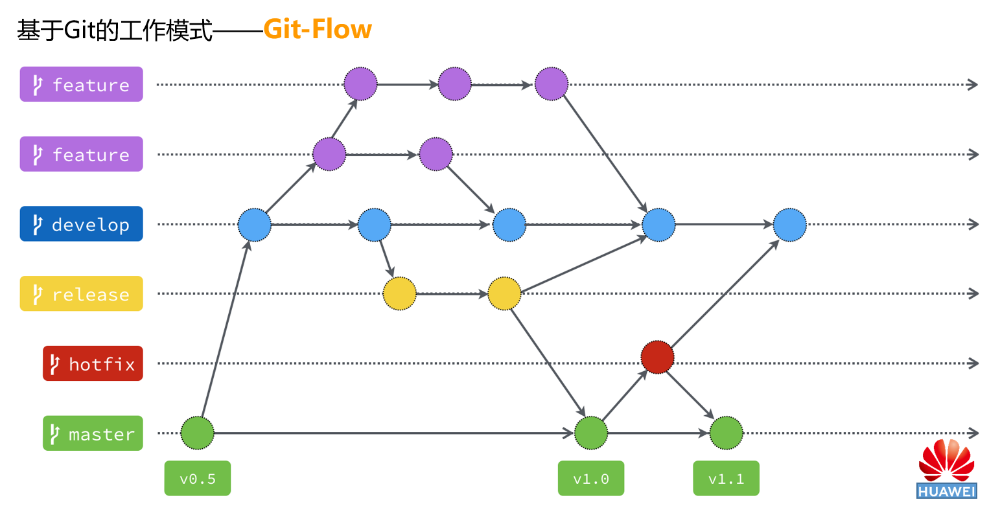

# 第1章 了解Git

参考廖雪峰网站教程：https://www.liaoxuefeng.com/wiki/896043488029600/896067008724000

官方文档：C:\Program Files\Git\mingw64\share\doc\git-doc

## 1.1 Git的简介

## 1.2 集中式与分布式版本控制系统
SVN 与 Git

### 1.2.1 集中式版本控制系统

### 1.2.2 分布式版本控制系统


# 第2章 安装与配置Git

## 2.1 Git安装程序的下载

### 2.1.1 官方网站
官网慢的要死，懒得找链接了，直接去镜像下载

### 2.1.2 镜像网站
  + 华为镜像网站：[Git for Windows 下载](https://mirrors.huaweicloud.com/git-for-windows/)
  + 其他

**【注意】**
+ 由于镜像网站很多都没有 GUI 界面，所以你需要学会找哪个网址是正确的下载地址，因为有时候你打开的可能是其他文件的下载地址（比如哈希值对比文件，或者其他操作系统的安装文件等等）。
+ Windows 系统（64位）的 Git 安装程序的文件名称为：Git-2.27.0-64-bit.exe

## 2.2 Git的安装
+ 文本编辑器：如果不熟悉 Vim，建议更换为 Visual Studio Code；
+ 

## 2.3 Git的配置
Git 提供了一个叫做 git config 的工具，专门用来配置或读取相应的工作环境变量。

### 2.3.1 用户信息的配置
配置个人的用户名称和电子邮件地址：
```bash
$ git config --global user.name "BitBitcode"
$ git config --global user.email 137XXXX451@qq.com
```
参数解释:
+ user.name：用户名："BitBitcode"
+ user.email：用户邮箱：137XXXX451@qq.com
+ --global 选项：修改用户主目录下的配置文件，所有的项目会默认使用此用户配置信息。

如果需要为不同的仓库配置不同的用户信息，则需要：
```bash
$ 未完
$
```

**【注意】**

+ 如果要在某个仓库中使用其他用户名和电子邮箱地址，只要去掉 --global 选项重新配置即可，新的设定保存在当前项目的 .git/config 文件里。

### 2.3.2 文本编辑器的配置
设置Git默认使用的文本编辑器, 一般可能会是 Vi 或者 Vim。如果你有其他偏好，比如 Emacs 的话，可以重新设置：
```bash
$ git config --global core.editor emacs
```

### 2.3.3 差异分析工具的配置
还有一个比较常用的是，在解决合并冲突时使用哪种差异分析工具。比如要改用 vimdiff 的话：
```bash
$ git config --global merge.tool vimdiff
Git 可以理解 kdiff3，tkdiff，meld，xxdiff，emerge，vimdiff，gvimdiff，ecmerge，和 opendiff 等合并工具的输出信息。
```

### 2.3.4 查看配置信息
1、要检查已有的配置信息，可以使用 git config --list 命令：
```bash
$ git config --list
http.postbuffer=2M
user.name=BitBitcode
user.email=137XXXX451@qq.com
```
**注意：**

+ 有时候会看到重复的变量名，那就说明它们来自不同的配置文件（比如 /etc/gitconfig 和 ~/.gitconfig），不过最终 Git 实际采用的是最后一个。

2、这些配置我们也可以在 ~/.gitconfig 或 /etc/gitconfig 看到：
```bash
vim ~/.gitconfig 
```
显示内容如下所示：
```bash
[http]
    postBuffer = 2M
[user]
    name = runoob
    email = test@runoob.com
```

3、也可以直接查阅某个环境变量的设定，只要把特定的名字跟在后面即可，像这样：
```bash
$ git config user.name
BitBitcode
```

# 第3章 创建Git仓库

## 3.1 创建新仓库
### 3.1.1 在本地创建仓库
1、首先建立文件目录。这一步可以通过文件资源管理器完成，也可以用代码完成：
```bash
$ cd C:/Github      // 也可以在这个目录下右键菜单选择“Git Bash here”
$ mkdir Git-Test
$ cd Git-Test
$ pwd               // 查看当前路径
/Users/WWC/Git-Test
```

2、初始化本地仓库。确保当前位于仓库文件夹的目录下，在Git Bash中输入：

```bash
$ git init
Initialized empty Git repository in C:/Github/Git-Test/.git/
```
这时，在仓库文件夹中添加了一个名为“.git”的隐藏文件夹，路径后面多了一个“(master)”，表明现在位于主分支。


### 3.1.2 在远程创建仓库
在Github或Gitee网站上创建同名称的空仓库

#### 3.1.2.1 Github仓库
1、点击“ ”

2、选择。。。

3、readme。。。

（未完，有心情的话补充图片）

#### 3.1.2.2 Gitee仓库
1、点击“ ”

2、选择。。。

3、readme。。。

（未完，有心情的话补充图片）

### 3.1.3 链接到远程仓库
#### 3.1.3.1 获取并添加SSH密钥

如果出现以下提示：

```bash
$ git clone https:/github.com/Bitbitcode/Git-Test
Cloning into 'Git-Test'...

？填写显示的报错内容？

Please make sure you have the correct access rights
and the repository exists.
```

则需要添加SSH密钥：

1、检查是否已经存在SSH密钥：在用户目录 C:/Users/WWC/.ssh 下，查看是否存在“id_rsa”和“id_rsa.pub”两个文件，如果已经存在，则跳过第二步。（注意：“id_rsa”是私钥，必须保密，“id_rsa.pub”是公钥，无需保密）

2、创建一个SSH密钥：在Git Bash中输入以下代码，

```bash
$ ssh-keygen -t rsa -C "smilewwc@qq.com"
```
（注意命令中的“-C”是大写“C”）

如果不需要设置密码，则全部回车即可：

```bash
WWC@Surface MINGW64 /c/WINDOWS/system32
$ ssh-keygen -t rsa -C "smilewwc@qq.com"
Generating public/private rsa key pair.
Enter file in which to save the key (/c/Users/WWC/.ssh/id_rsa):
Created directory '/c/Users/WWC/.ssh'.
Enter passphrase (empty for no passphrase):
Enter same passphrase again:
Your identification has been saved in /c/Users/WWC/.ssh/id_rsa
Your public key has been saved in /c/Users/WWC/.ssh/id_rsa.pub
The key fingerprint is:
SHA256:/+wqiLZ2ffjZzoWIM4Em3uLbPkeIKHrVQrSjB3M3NOU smilewwc@qq.com
The key's randomart image is:
+---[RSA 3072]----+
|       ..        |
|    . o.         |
|   . o .E        |
|  o = o.         |
|   B.=ooS        |
|. o.=+o .+ . .   |
|.. ooo.++.o . .  |
|. ..+o+ =o.* .   |
| . o+=oo +++B    |
+----[SHA256]-----+
```

完成后重复第一步的检查工作；

3、在远程代码管理网站添加SSH密钥
+ Github：登陆GitHub，打开“Account settings”，“SSH Keys”页面，然后，点“Add SSH Key”，填上任意Title，在Key文本框里粘贴id_rsa.pub文件的内容；
+ Gitee：右上角用户头像 -> 菜单“修改资料”，然后选择“SSH公钥”，填写一个便于识别的标题，然后把用户主目录下的.ssh/id_rsa.pub文件的内容粘贴进去；

#### 3.1.3.2 将本地仓库链接到远程仓库
【语法】 `git remote add origin 仓库URL.git`：
```bash
$ git remote add origin https://github.com/Bitbitcode/Git-Test.git
```

**【报错解决】**如果遇到以下提示：

```bash
fatal: refusing to merge unrelated histories
```

这是因为远程Git服务器认为这是两个根本不相干的仓库，（一个是本地库，一个是远端库），然后本地要去推送到远端，远端觉得这个本地库跟自己不相干，所以告知无法合并。解决方法：
+ 如果这不是新的仓库（即这个仓库以前创建过），那么推荐使用克隆的方法：从远端库拉下来代码，本地要加入的代码放到远端库下载到本地的库，然后提交上去，因为这样的话，你基于的库就是远端的库，这是一次update了（有关克隆仓库的详细内容将在下一节讲解）；
+ 如果这是新建的仓库，那么使用强制的方法:
  ```bash
  $ git pull origin master --allow-unrelated-histories
  ```
  后面加上 --allow-unrelated-histories ， 把两段不相干的分支进行强行合并，后面再push就可以了 git push gitlab master:init

至此我们就完成了新仓库的创建工作，之后的工作不需要再次进行上述操作，只需要普通的pull、push操作即可。

## 3.2 克隆已有仓库
在Git Bash中，先导航到克隆的位置，然后输入 `git clone 仓库的URL`：
```bash
$ cd C:/Github
$ git clone https://gitee.com/Acrylic-Studio/Git-Test
```
命令行将显示：
```bash
Cloning into 'Git-Test'...
remote: Enumerating objects: 19, done.
remote: Counting objects: 100% (19/19), done.
remote: Compressing objects: 100% (18/18), done.
remote: Total 19 (delta 7), reused 0 (delta 0), pack-reused 0
Unpacking objects: 100% (19/19), 7.01 KiB | 64.00 KiB/s, done.
```

**【报错解决】**

如果出现以下提示：

```bash
WWC@Surface MINGW64 /c/github
$ git push origin master
fatal: not a git repository (or any of the parent directories): .git
```

提示的意思是“这不是一个Git仓库”，注意观察此时第一行的路径并不是仓库的路径，我们之前的操作在路径“C:/Github”下，还没有进入到仓库的路径下，所以还需要导航到该仓库的目录下：

```bash
WWC@Surface MINGW64 /c/github
$ cd Git-Test

WWC@Surface MINGW64 /c/github/Git-test (master)
$
```

这时在路径后显示了“(master)”，表明目前位于主分支。

至此我们就完成了仓库的克隆工作，之后的工作不需要再次进行上述操作，只需要普通的pull、push操作即可。

## 3.3 链接多个远程仓库

最常见的操作是将一个仓库同时链接到Github和Gitee

**1、在仓库目录下查看当前链接的远程仓库**

```bash
$ git remote -v
```

命令行显示：

```bash
origin  https://gitee.com/Acrylic-Studio/Git-Test (fetch)
origin  https://gitee.com/Acrylic-Studio/Git-Test (push)
```

也就是说，我们平时输入的命令`$ git push origin master`中的 “origin” 只是一个默认名称而已，其具体地址取决于你克隆或首次链接时候的仓库URL。

**2、删除已链接的远程仓库**

```bash
$ git remote remove origin
```

该命令也可以简写为：`$ git remote rm origin`

**3、添加新的远程仓库**

【语法】`$ git remote add [远程服务器名称] git@[远程服务器域名]:[用户域名/仓库名称].git`

```bash
$ git remote add Gitee git@gitee.com:Acrylic-Studio/Git-Test.git
$ git remote add Github git@github.com:Bitbitcode/Git-Test.git
```
这时再次查看远程仓库信息，发现已经添加了两个远程服务器：
```bash
$ git remote -v
Gitee   git@gitee.com:Acrylic-Studio/Git-Test.git (fetch)
Gitee   git@gitee.com:Acrylic-Studio/Git-Test.git (push)
Github  git@github.com:Bitbitcode/Git-Test.git (fetch)
Github  git@github.com:Bitbitcode/Git-Test.git (push)
```

也可以不加 “-v” 查看简略信息，这时候不显示远程仓库的地址：

```bash
WWC@Surface MINGW64 /c/github/git-test (master)
$ git remote
Gitee
Github
```

此后，将指令改为：`$ git push Github master `，`$ git push Gitee master `即可。

# 第4章 代码的拉取与提交

## 4.1 拉取已有的远程代码

【语法】```$ git fetch [远程源名称] [分支名称]```

如果没有更改过远程仓库的服务器地址和名称，那么就直接使用以下命令：

```bash
$ git fetch origin master
```

如果更改了远程仓库的服务器地址和名称，如上一章中连接到两个远程仓库，则需要使用更改时设置的远程Git服务器名称（注意，此处对大小写敏感），例如：

```bash
WWC@Surface MINGW64 /c/github/git-test (master)
$ git fetch Gitee master
From gitee.com:Acrylic-Studio/Git-Test
 * branch            master     -> FETCH_HEAD
 * [new branch]      master     -> Gitee/master
 
WWC@Surface MINGW64 /c/github/git-test (master)
$ git fetch Github master
Warning: Permanently added the RSA host key for IP address '52.74.223.119' to the list of known hosts.
From github.com:BitBitcode/Git-Test
 * branch            master     -> FETCH_HEAD
 * [new branch]      master     -> Github/master
```

【语法】```$ git pull [远程源名称] [分支名称]```

```bash
$ git pull origin master
```

## 4.2 提交更改并上传至远程仓库

### 4.2.1 常规提交流程
一次完整的提交操作为：
```bash
$ git add .
$ git commit -m "本次提交的描述"
$ git push origin master 
```

#### 1、添加文件
【语法】```$ git add [文件路径]/[文件名称]```
首先要将文件添加（add）到仓库中，只有添加之后的文件才会被Git监控，否则的话即使文件保存在仓库文件夹下（包括子文件夹），也不会被提交（commit）或上传（push），例如“Sample_File.txt”还未被添加到仓库中，仓库将显示“Untracked files”：

```bash
WWC@Surface MINGW64 /c/Github/Git-Test (master)
$ git status
On branch master
Changes to be committed:
  (use "git restore --staged <file>..." to unstage)
        modified:   Git_Learning.md

Untracked files:
  (use "git add <file>..." to include in what will be committed)
        Sample_File.txt
```
【注意】```$ git status```命令用于查看当前仓库的状态，将在 “4.3.1 当前仓库的状况” 中详细学习。

#### 2、提交更改
【语法】```$ git commit -m "本次提交的概述"```
提交和添加的区别在于，提交（commit）将被记录在仓库的日志中，而添加（add）只是将文件或更改添加到当前的仓库中，不会被记录了下来。在实际工作中，可以多次添加，然后统一提交。
【注意】提交命令还有很多不同的用法，将在下一节中学习

#### 3、推送到远程仓库
【语法】```$ git push [远程服务器名称] [需要提交的分支]```
对于默认的远程服务器和分支，一般的命令为：```$ git commit origin master```
【注意】如果你设置了多个远程仓库，应改为：```$ git push [远程仓库名称] master```

### 4.2.2 提交（commit）命令

#### 1、普通提交

【语法】```$ git commit -m "massage"```

```bash
$ git commit -m '
	message1
	message2
	message3
	'
```

#### 2、添加并提交

【语法】```$ git commit -a -m "massage"```

#### 3、追加提交

【语法】```$ git commit --amend```

#### X、查看帮助

【语法】```$ git commit --help```

此命令将打开官方帮助文档，帮助文件的路径为：C:/ProgramFiles/Git/mingw64/share/doc/git-doc/git-commit.html

**【报错解决】**

如果提交代码时遇到以下提示：

```bash
$ git push origin master
remote: Kiana_Kaslana: Incorrect username or password (access token)
```
则说明在首次提示填写用户名和密码时填写错误，这里需要区别“用户名”和“昵称”：用户名实际上是网站中你的域名，而不是设置页的昵称，所以如果填错，远程Git服务器将不能识别（毕竟域名错了），这时需要在控制面板中删除原先的凭据，步骤如下：
1. 打开控制面板；
2. 点击用户账户；
3. 点击凭据管理器；
4. 选择“Windows凭据”选项卡；
5. 找到并删除该远程Git服务器的凭据；
6. 重新push提交代码，会弹出输入用户名和密码的对话框，输入正确的用户名和密码即可。

删除后再次执行提交操作，按照提示重新输入正确的用户名和密码即可。

## 4.3 查看仓库情况与文件更改

### 4.3.1 当前仓库的状况

【语法】```$ git status```

命令行将返回当前仓库的情况，包括未添加（add）的信息和未提交（commit）的信息：

```bash
WWC@Surface MINGW64 /c/github/Git-Test (master)
$ git status
On branch master
Changes to be committed:
  (use "git restore --staged <file>..." to unstage)
        new file:   Sample_Code.c

Changes not staged for commit:
  (use "git add <file>..." to update what will be committed)
  (use "git restore <file>..." to discard changes in working directory)
        modified:   "Git_Learning.md"
```

如果所有更改已提交、上传，将显示：

```bash
WWC@Surface MINGW64 /c/github/Git-Test (master)
$ git status
On branch master
nothing to commit, working tree clean
```

### 4.3.2 某个文件的具体更改

【语法】```$ git diff Sample.c```

命令行将显示该文档的改动：

```bash
WWC@Surface MINGW64 /c/github/Git-Test (master)
$ git diff Sample.c
diff --git a/Sample.c b/Sample.c
index 51496ea..5a44467 100644
--- a/Sample_Code.c
+++ b/Sample_Code.c
@@ -2,5 +2,6 @@

 int main()
 {
+       printf("Hello World!\n");
        return 0;
 }
\ No newline at end of file
```

【注意】不显示任何消息的情况：

+ 如果没有更改，或多次更改后最终没有变化（有点像”位移“的概念），将不显示任何消息；
+ 如果该文件没有被Git监控，将不显示任何消息。也就是说必须先将文件添加到仓库中（$ git add命令）；
+ 如果文件名输入不正确（此处大小写敏感），将不显示任何消息。

### 4.3.3 查看该仓库的所有记录

【语法】```$ git log```

命令行将显示部分信息（由于窗口大小的限制），按下回车键会继续显示，直到最开始的记录。也就是说，先显示较新的记录，后显示较旧的记录：

```bash
WWC@Surface MINGW64 /c/github/Git-Test (master)
$ git log
commit 01bdddc831feea7452f633525b2652074c05fece (HEAD -> master, Gitee/master)
Author: Acrylic-Studio <smilewwc@qq.com>
Date:   Tue Jul 28 14:34:54 2020 +0800

    continue writting the learning note

commit b64cef89e700cadb21ba61d932407ea5806bcaa3
Author: Acrylic-Studio <smilewwc@qq.com>
Date:   Sun Jul 26 13:36:06 2020 +0800

    add a sample file

commit 2b034c7dc316de514e58917140aa3654e79a035e
Author: Acrylic-Studio <smilewwc@qq.com>
Date:   Tue Jul 21 23:47:33 2020 +0800

    delete

commit b911c37b3abf10ffcf4a19c1da60851bf37a39d3
Merge: af724fa 3a4b643
Author: Acrylic-Studio <smilewwc@qq.com>
Date:   Tue Jul 21 23:45:48 2020 +0800

    Merge branch 'master' of gitee.com:Acrylic-Studio/Git-Test

commit af724fa5a7f8f44de1ccca5252e3466a092fa949
Author: Acrylic-Studio <smilewwc@qq.com>
Date:   Tue Jul 21 23:34:01 2020 +0800

    Add files

commit 3a4b64322ea791961ce9d07d9b0a8a255aa1e1ec
Author: Kiana_Kaslana <smilewwc@qq.com>
Date:   Tue Jul 21 23:22:36 2020 +0800

    Initial commit
(END)
```

当命令行显示```(END)```时，表明所有记录已显示。但此时我们会发现无法输入命令，按回车键也没有任何反应，此时只需**按下字母”q“键**即可恢复到输入命令的状态（当然，在记录未全部显示的过程中也可以随时按“q”返回到命令行状态）：

```bash
... ...

commit af724fa5a7f8f44de1ccca5252e3466a092fa949
Author: Acrylic-Studio <smilewwc@qq.com>
Date:   Tue Jul 21 23:34:01 2020 +0800

    Add files

commit 3a4b64322ea791961ce9d07d9b0a8a255aa1e1ec
Author: Kiana_Kaslana <smilewwc@qq.com>
Date:   Tue Jul 21 23:22:36 2020 +0800

    Initial commit

（此处按下了“q”）

WWC@Surface MINGW64 /c/github/Git-Test (master)
$
```

## 4.X 添加标签

注意切换到要打标签的分支

【语法】```$ git tag [标签名称]```

```bash
$ git tag V1.0.0.20200730_beat
```
查看标签

【语法】```$ git tag```

```bash
WWC@Surface MINGW64 /c/Github/Mystyle (master)
$ git tag
V1.0.0.20200730_Beta
```

删除标签

【语法】```$ git tag -d [标签名称]```

```bash
WWC@Surface MINGW64 /c/Github/Mystyle (master)
$ git tag -d V1.0.0.20200730_beat
Deleted tag 'V1.0.0.20200730_beat' (was 8fbc171)
```

推送标签

【语法】```$ git push origin [标签名称]```

```bash
WWC@Surface MINGW64 /c/Github/Mystyle (master)
$ git push origin V1.0.0.20200730_Beta
Enumerating objects: 4, done.
Counting objects: 100% (4/4), done.
Delta compression using up to 8 threads
Compressing objects: 100% (3/3), done.
Writing objects: 100% (3/3), 397 bytes | 397.00 KiB/s, done.
Total 3 (delta 1), reused 0 (delta 0), pack-reused 0
remote: Powered by GITEE.COM [GNK-5.0]
To https://gitee.com/Acrylic-Studio/Mystyle
 * [new tag]         V1.0.0.20200730_Beta -> V1.0.0.20200730_Beta
```


# 第5章 分支管理

## 5.1 分支与分支模型

### 5.1.1 Git的分支管理

什么是分支

为什么需要分支

### 5.1.2 Git-Flow分支模型



其中：

+ **master分支**：最为稳定，功能比较完整，随时可发布的代码；
+ **develop分支**：用于平时开发的主分支，并一直存在，永远是功能最新最全的分支，包含所有要发布到下一个 release 的代码，主要用于合并其他分支；
+ **feature分支**：用于开发新的功能的分支，一旦开发完成，通过测试，合并回 develop 分支进入下一个 release；
+ **release分支**：用于发布准备的专门分支；
+ **hotfix分支**：用于修复线上代码的 bug。

说明： 

+ 所有开发分支从 develop 分支拉；
+ 所有 hotfix 分支从 master 拉；
+ 所有在 master 上的提交都必要要有 tag，方便回滚；
+ 只要有合并到 master 分支的操作，都需要和 develop 分支合并下，保证同步；
+ master 和 develop 分支是主要分支，主要分支每种类型只能有一个，派生分支每个类型可以同时存在多个。

## 5.2 创建与切换分支

创建分支

【语法】```$ git branch [分支名称]```

查看当前所有分支

【语法】```$ git branch```

切换到某个分支

【语法】

+ ```$ git checkout [分支名称]```
+ ```$ git switch [分支名称]``` 

还有另一种简便方式，创建并切换到该分支：

【语法】：

+ ```$ git checkout -b [分支名称]```
+ ```$ git switch -c [分支名称]```

```bash
WWC@Surface MINGW64 /c/Github/Mystyle (master)
$ git branch develop

WWC@Surface MINGW64 /c/Github/Mystyle (master)
$ git branch
  develop
* master

WWC@Surface MINGW64 /c/Github/Mystyle (master)
$ git checkout develop
Switched to branch 'develop'

WWC@Surface MINGW64 /c/Github/Mystyle (develop)
$ git branch
* develop
  master
```

这时我们看到路径后括号内的文字变为“develop”，表明已经切换到了该分支。另外注意到，之前master前面有一个星号（\*），切换后develop前出现星号（\*），即星号表明当前所在的分支。

## 5.3 合并与删除分支

当一些分支的内容开发完毕后，需要合并到其他分支

首先切换到将要合入的分支：

如果当前分支尚有未提交的更改，系统将发出警告：

```bash
WWC@Surface MINGW64 /c/Github/Mystyle (feature-carousel)
$ git checkout develop
error: Your local changes to the following files would be overwritten by checkout:
        index.html
Please commit your changes or stash them before you switch branches.
Aborting
```

将某个分支合并到当前分支

【语法】```$ git merge [分支名称]```

```bash
WWC@Surface MINGW64 /c/Github/Mystyle (develop)
$ git merge feature-carousel
Updating 1f410aa..4612f0b
Fast-forward
 images/carousel/slide_1.jpg                        | Bin 0 -> 363920 bytes
 images/carousel/slide_2.jpg                        | Bin 0 -> 268141 bytes
 images/carousel/slide_3.jpg                        | Bin 0 -> 226495 bytes
```

删除分支

如果不再需要该分支，可以删除该分支

【语法】```$ git branch -d [分支名称]```

## 5.4 解决冲突


# 第6章 Git高级用法

## 6.1 忽略不需同步的文件


## 6.2 配置别名


## 6.3 搭建Git服务器


